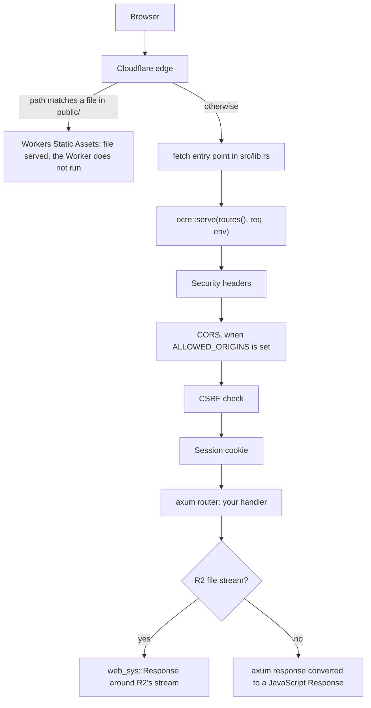

# Architecture

An Ocre app is one Rust crate compiled to WebAssembly and run as a single Cloudflare Worker, with `ocre::serve` wrapping a plain axum router. This page follows a request through the app, maps each Ocre feature to the Cloudflare product behind it, and explains the WebAssembly constraints that shape the framework.

## Before you start

Nothing to install to read this page. The code shown comes from apps made with `ocre new blog --starter blog` and the generators named next to it; [Installation](../getting-started/installation.md) and the [tutorial](../getting-started/tutorial.md) get you one.

## The pieces

| Piece | What it is | Where |
|---|---|---|
| Your app | A Rust crate with `crate-type = ["cdylib"]`: `src/lib.rs` holds the Worker entry points and `routes()`; the generators write models, controllers, templates and migrations next to it | your repository |
| `ocre` | The framework crate: `serve`, `Ctx`, `Db`, `Error`, sessions, validations, and one module per Cloudflare product (`jobs`, `storage`, `cache`, `mail`, `realtime`...) | `crates/ocre` |
| `worker` | Cloudflare's [workers-rs](https://github.com/cloudflare/workers-rs) 0.8: Rust bindings to the Workers JavaScript runtime, the `#[event(...)]` entry-point macros, and the axum integration | dependency of both |
| `worker-build` | Compiles the crate to `wasm32-unknown-unknown`, runs `wasm-bindgen` (and `wasm-opt` in release), and writes `build/index.js` plus `build/index_bg.wasm` | run by the `[build]` command of `wrangler.toml` |
| wrangler | Cloudflare's CLI: `wrangler dev` runs the Worker locally in workerd, `wrangler deploy` uploads it | `npx wrangler@4` |
| `ocre` CLI | Generators, plus commands that drive wrangler (`ocre dev`, `ocre deploy`, `ocre migrate`, `ocre sql`...) | `crates/ocre-cli` |

`ocre dev` and production run the same runtime, workerd: locally, wrangler simulates D1 (SQLite files under `.wrangler/state`), Queues, R2, KV and Durable Objects, and `ocre dev` builds without optimizations (`worker-build --dev`) to compile faster.

## A request, step by step



1. **Static files first.** `wrangler.toml` declares `[assets] directory = "public"`. Cloudflare serves a request that matches a file in `public/` (`/robots.txt`, images, CSS) from Workers Static Assets, without invoking the Worker: no Worker request counted, no CPU used.
2. **The Worker's `fetch` event.** Every other request runs the entry point `ocre new` writes into `src/lib.rs`:

   ```rust
   #[event(fetch)]
   async fn fetch(req: HttpRequest, env: Env, _ctx: Context) -> worker::Result<worker::web_sys::Response> {
       ocre::serve(routes(), req, env).await
   }
   ```

3. **`ocre::serve`.** It builds a [`Ctx`](/api/ocre/struct.Ctx.html) from the Worker's environment and gives it to the router as axum state, reads the `SECRET_KEY_BASE` secret and the `ALLOWED_ORIGINS` variable, and wraps the router in the middleware every Ocre app runs, outermost first:

   | Layer | Does | Costs |
   |---|---|---|
   | Security headers | Adds `X-Content-Type-Options: nosniff`, `X-Frame-Options: SAMEORIGIN`, `Referrer-Policy: strict-origin-when-cross-origin`, `X-XSS-Protection: 0`, `X-Permitted-Cross-Domain-Policies: none`, and HSTS on HTTPS; a handler's own value wins | nothing |
   | CORS | Only when `ALLOWED_ORIGINS` lists origins: answers preflights and adds CORS headers for them | nothing |
   | CSRF | Refuses with 403 an unsafe request (or a WebSocket handshake) that a browser sends from another site, judged by `Sec-Fetch-Site`, else `Origin` against `Host` | nothing |
   | Session | Decrypts the `_ocre_session` cookie on first use, re-encrypts it into `Set-Cookie` when a handler changed it | no D1 row, no KV operation |

   A missing or short `SECRET_KEY_BASE` does not break every request: only handlers that touch the session get a 500 whose log names the fix. The details of each layer are in [Security model](security-model.md).
4. **Your handler.** Handlers are plain axum handlers. They reach Cloudflare through `State(ctx): State<Ctx>`:

   ```rust,check
   // src/stats.rs (register it with `mod stats;` and `.merge(stats::routes())` in src/lib.rs)
   use axum::{Router, extract::State, routing::get};
   use ocre::{Ctx, Result, params};
   use serde::Deserialize;

   #[derive(Deserialize)]
   struct Count {
       count: i64,
   }

   pub fn routes() -> Router<Ctx> {
       Router::new().route("/stats", get(stats))
   }

   /// `GET /stats`: one D1 query through the `DB` binding, and a `[vars]` value.
   async fn stats(State(ctx): State<Ctx>) -> Result<String> {
       let row: Option<Count> = ctx.db()?.first("SELECT COUNT(*) AS count FROM posts", params![]).await?;
       let sender = ctx.env().var("MAIL_FROM")?.to_string();
       Ok(format!("{} posts; mail from {sender}", row.map_or(0, |row| row.count)))
   }
   ```

   `ctx.db()` is the D1 binding `DB`; `ctx.env()` is the raw Workers environment, for variables, secrets and bindings Ocre does not wrap. A handler error is a response (an HTML error page, or JSON through `ApiError`); internal details are logged, never sent.
5. **The response.** `serve` turns the axum response into a JavaScript `Response` with `worker::response_to_wasm`, except for files from R2 (next section).

## Streaming files from R2

An axum body passes through Rust: each chunk is copied from JavaScript into WebAssembly memory and back out, which costs CPU on large files and loses `Content-Length`. `ocre::storage::serve` avoids that. It returns an axum response whose headers are set (type, length, `ETag`, `Range`, `Content-Disposition`) and puts R2's `ReadableStream` in the response's extensions; `ocre::serve` sees it and builds a `web_sys::Response` from those headers with R2's stream as the body. The bytes go from R2 to the client inside the JavaScript runtime and never enter WebAssembly.

That is why a generated `fetch` returns `worker::Result<worker::web_sys::Response>` rather than an axum or `worker::Response`: `serve` needs to hand back a JavaScript response it built itself. See [File storage](../guides/files.md).

## Cloudflare products behind each feature

One Worker handles every kind of event: HTTP requests, queue batches, cron runs and incoming email. Each invocation has its own CPU budget (10 ms on the free plan). The bindings are declared in `wrangler.toml`; the generator that first needs one adds it.

| Feature | Cloudflare product | Binding or config | Ocre API | Added by |
|---|---|---|---|---|
| Static files | Workers Static Assets | `[assets] directory = "public"` | none | `ocre new` |
| Models, migrations | D1 (SQLite) | `[[d1_databases]] binding = "DB"` | `ctx.db()`, `Db::all` / `first` / `execute` / `batch`, `params!` | `ocre new` |
| Sessions, flash | none: an encrypted cookie | `SECRET_KEY_BASE` secret | `Session`, `Flash` | `ocre new` (`.dev.vars`), `ocre deploy` |
| Background jobs | Queues | `[[queues.producers]] binding = "JOBS"`, `[[queues.consumers]]`, a dead-letter queue | `ocre::jobs::enqueue`, `enqueue_in`; entry point `consume` | `ocre g job` |
| Scheduled tasks | Cron Triggers | `[triggers] crons` | entry point `ocre::jobs::cron` | `ocre g schedule` |
| Files | R2 | `[[r2_buckets]] binding = "STORAGE"` | `ocre::storage` | first `attachment` field |
| Realtime | Durable Objects (WebSocket Hibernation) | `[[durable_objects.bindings]] name = "CHANNELS"`, `[[migrations]]` | `ocre::realtime`, the `OcreChannel` class (feature `realtime`) | `ocre g scaffold ... --realtime` |
| Cache | Workers KV | `[[kv_namespaces]] binding = "CACHE"` | `ocre::cache` | `ocre g cache` |
| Sending email | Resend's HTTP API, or Email Service | `MAIL_ADAPTER`, `MAIL_FROM`; `RESEND_API_KEY` or `[[send_email]] name = "EMAIL"` | `ocre::mail::send`, `deliver_later` | `ocre new` (`[vars]`), `ocre g mailer` |
| Receiving email | Email Routing | a routing rule in the dashboard | entry point `ocre::mail::receive` | `ocre g mailbox` |

The generators add the matching entry point to `src/lib.rs`; each hands the event and the environment to Ocre, which builds a `Ctx` and calls your code (from the fixture app of these docs, after `ocre g mailbox`, `ocre g job` and `ocre g schedule`):

```rust
/// Incoming email from Cloudflare Email Routing, handled in src/mailbox.rs.
#[worker::event(email)]
async fn email(message: worker::ForwardableEmailMessage, env: worker::Env, _ctx: worker::Context) -> worker::Result<()> {
    ocre::mail::receive(message, env, mailbox::receive).await
}

/// Background jobs from the `JOBS` queue, run by `jobs::perform` (src/jobs/mod.rs).
#[worker::event(queue)]
async fn queue(batch: worker::MessageBatch<String>, env: worker::Env, _ctx: worker::Context) -> worker::Result<()> {
    ocre::jobs::consume(batch, env, jobs::perform).await
}

/// Cron Triggers (`[triggers] crons` in wrangler.toml), run by `schedules::run` (src/schedules/mod.rs).
#[worker::event(scheduled)]
async fn scheduled(event: worker::ScheduledEvent, env: worker::Env, _ctx: worker::ScheduleContext) {
    ocre::jobs::cron(event, env, schedules::run).await
}
```

The app's Worker is both producer and consumer of its jobs queue, and the realtime Durable Object class `OcreChannel` ships inside the same WebAssembly module: there is one deployable unit. What each product costs on the free plan is in [Cost model](cost-model.md) and [Free-plan limits](../reference/limits.md).

## WebAssembly constraints

The Worker is built for `wasm32-unknown-unknown` and runs inside a V8 isolate. That rules out much of the usual Rust server stack:

- **No threads, no filesystem, no sockets, no tokio.** Crates that need them (sqlx, tokio, reqwest with native TLS) do not compile for this target. Outgoing HTTP goes through `worker::Fetch`, databases through bindings. Futures are driven by JavaScript promises (`wasm-bindgen-futures`) on the isolate's single thread.
- **No system clock.** `std::time::SystemTime::now()` panics on this target; `ocre::now()` reads JavaScript's `Date.now()`, which Workers advance only between I/O operations. For the same reason, Ocre expires the session cookie with a fixed past date rather than computing one.
- **Randomness and crypto from WebCrypto.** Random bytes (session nonces, salts, tokens) come from `crypto.getRandomValues` through `getrandom`'s `js` feature. Password hashing calls `crypto.subtle.deriveBits` (PBKDF2), which runs natively in workerd: bcrypt or argon2 compiled to WebAssembly would not fit the free plan's 10 ms of CPU.
- **`Send` without threads.** axum requires handler futures to be `Send`, but JavaScript handles (the environment, a D1 database, a stream) are not. Ocre wraps each one in `worker::send::SendWrapper` (and futures in `SendFuture`), which is sound because a Worker runs your code on a single thread. As a result every Ocre type is `Send`, and handlers never need `#[worker::send]`.
- **Size and start-up time.** The release profile of a generated app uses `lto = true`, `codegen-units = 1` and `opt-level = "z"`, and `worker-build` runs `wasm-opt`; symbols are kept because stripping breaks `wasm-bindgen`. The blog starter's `index_bg.wasm` is 766,215 bytes (September 2026). Opt-in cargo features keep costly code out of apps that do not use it: GraphQL adds about 1.1 MB and 20-60 ms of CPU when an instance starts.

Ocre and the app also compile natively, for `cargo test`: code that calls the runtime is behind `#[cfg(target_arch = "wasm32")]` or only reachable through a `Ctx`, and `ocre::password` uses a pure-Rust PBKDF2 there. See [Testing an Ocre app](../guides/testing.md).

## Crate layout

The framework crate keeps what cannot be generated: the parts that talk to the JavaScript runtime, and security-sensitive primitives.

```text
crates/ocre/
  src/
    lib.rs          serve, Ctx, Db, params!, Error, Json, Session, Validator... (re-exports)
    protect.rs      security headers, CORS, CSRF, session layer
    session.rs      encrypted cookie sessions and flash
    api.rs          JSON responses and errors, Page
    validate.rs     Validator
    password.rs, token.rs, jwt.rs    auth primitives
    jobs.rs, storage.rs, cache.rs, mail.rs, realtime.rs, i18n.rs, graphql.rs
    error.rs, sql.rs, fields.rs, clock.rs, view.rs, htmx.rs, ...
    runtime/        everything that calls the Workers JavaScript runtime:
                    ctx.rs, d1.rs, jobs.rs, storage.rs, cache.rs, mail.rs,
                    realtime.rs (the OcreChannel Durable Object), crypto.rs, jwt.rs
  tests/            unit tests, one file per source file
```

Code under `runtime/` only runs inside workerd; it is tested end to end with generated apps (`crates/ocre-cli/tests/system/e2e.rs`), everything else by native unit tests.

| Cargo feature | Default | Enables |
|---|---|---|
| `html` | yes | askama templates (`render`), HTML error pages, the `Htmx` extractor. API-only apps (`ocre new --api`) turn it off |
| `graphql` | no | The `graphql` module (async-graphql); `ocre g api ... --graphql` turns it on |
| `realtime` | no | The `realtime` module and the exported `OcreChannel` Durable Object class; `ocre g scaffold ... --realtime` turns it on |

## See also

- [Why generated code](generated-code.md): what lives in your app rather than in the `ocre` crate
- [Security model](security-model.md): the middleware layers in detail
- [Cost model](cost-model.md) and [Free-plan limits](../reference/limits.md)
- [Deployment](../guides/deployment.md): how `ocre deploy` provisions each product
- [API index](../api-index.md) and the [rustdoc reference](/api/ocre/index.html)
