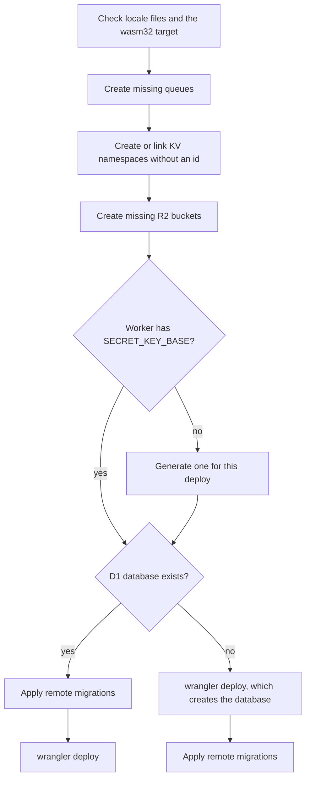

# Deployment

The `ocre deploy` command builds the app in release mode, creates the Cloudflare resources it is missing, applies the D1 migrations and publishes the Worker on `workers.dev`. This page explains each step, how to set production variables and secrets, run commands on the production database, roll back, add a custom domain, read logs and deploy from CI.

## Before you start

- An Ocre app created with `ocre new`.
- Rust installed with rustup (the app's `rust-toolchain.toml` adds the `wasm32-unknown-unknown` target) and Node.js 20 or newer (the CLI runs `npx wrangler@4`).
- A Cloudflare account; the free plan is enough. Sign up at <https://dash.cloudflare.com/sign-up>.
- If the app has `attachment` fields (an `[[r2_buckets]]` entry in `wrangler.toml`): R2 enabled once in the dashboard (Storage & databases > R2). Cloudflare asks for a payment method even for the free tier ([R2 pricing](https://developers.cloudflare.com/r2/pricing/), September 2026).
- Either a browser login (`ocre login`, below) or an API token in `CLOUDFLARE_API_TOKEN` (see [Deploy from CI](#deploy-from-ci-with-an-api-token)).

## Log in to Cloudflare

```sh
ocre login
```

`ocre login` runs `wrangler whoami --json`; when you are not logged in, it runs `wrangler login`, which opens the browser to approve access, then checks again. It prints `Logged in to Cloudflare as <your email>` (with `--json`: `{"command":"login","email":"<your email>","ok":true}`). Wrangler keeps the login, so this is needed once per machine.

### Several Cloudflare accounts

When your login has access to several accounts, wrangler needs to know which one to deploy to:

- New app: `ocre new blog --account-id <id> --login` (or `--deploy`) checks that the login can use that account and writes `account_id = "<id>"` right after the `name` line of `wrangler.toml`. Without `--account-id`, `ocre new --login` fails with `this Cloudflare login has several accounts` and a hint listing them as `id (name)`.
- Existing app: add `account_id = "<id>"` next to `name` in `wrangler.toml` yourself, or set `CLOUDFLARE_ACCOUNT_ID` in the environment. `npx wrangler whoami` lists the accounts of your login.

## Deploy

```sh
ocre deploy
```

Run it from the app directory (or any directory below it). It takes the same steps on every deploy, stops at the first failure with an error and a hint naming the fix, and never deploys half-provisioned:



1. **Checks.** Locale files the Worker could not load (`locales/*.yml`) stop the deploy with the file, the line and the fix (see [Translations](i18n.md)). Then it checks that `rustc` has the `wasm32-unknown-unknown` target; if not: `the wasm32-unknown-unknown target is not installed for rustc at <sysroot>`, with the hint to use a rustup toolchain.
2. **Queues.** For every queue `wrangler.toml` names (`[[queues.producers]] queue`, `[[queues.consumers]] queue` and `dead_letter_queue`, written by the first `ocre g job`), it runs `wrangler queues info <name>` and `wrangler queues create <name>` for the missing ones. A consumer of a missing queue would fail the deploy.
3. **KV namespaces.** Each `[[kv_namespaces]]` entry without an `id` (the `CACHE` binding of `ocre g cache`) gets the namespace titled `<worker name>-<binding>`, lowercased with `_` as `-` (`blog-cache`). If `wrangler kv namespace list` already has it, it is linked; otherwise `wrangler kv namespace create` makes it. Either way `ocre deploy` writes `id = "<id>"` under the binding in `wrangler.toml`: commit that change.
4. **R2 buckets.** Each `bucket_name` of `[[r2_buckets]]` (`<app>-storage`, written by the first `attachment` field) is checked with `wrangler r2 bucket info` and created with `wrangler r2 bucket create` when missing. An account without R2 gets Cloudflare's API error 10042, and the deploy stops with this hint: "enable R2 once in the Cloudflare dashboard (Storage & databases > R2; the free plan asks for a payment method but charges nothing within 10 GB, 1M writes and 10M reads a month), then run `ocre deploy` again".
5. **`SECRET_KEY_BASE`.** It runs `wrangler secret list`. When the Worker has no `SECRET_KEY_BASE` (or does not exist yet), it generates a random one (128 hex characters, like `ocre secret`), writes it to `.wrangler/ocre-secrets.env` (readable by you only, git-ignored), passes it to `wrangler deploy --secrets-file`, and deletes the file afterwards, even when the deploy fails. An existing secret is never replaced: that would sign every user out. If `wrangler secret list` fails for any other reason, the deploy stops rather than risk overwriting it.
6. **Database and code.** It looks for the `database_name` of the `DB` binding in `wrangler d1 list`:
   - The database exists: `wrangler d1 migrations apply <database> --remote` first, then `wrangler deploy`, so the new code never runs against an old schema.
   - It does not (first deploy): `wrangler deploy` first, which creates the database because `wrangler.toml` has no `database_id`, then the migrations. Until they finish, pages that query the database fail.
7. **Build.** `wrangler deploy` runs the `[build]` command of `wrangler.toml`, `worker-build --release` (installing `worker-build` 0.8 with `cargo install` if needed): an optimized WebAssembly build passed through `wasm-opt`. Durable Objects (the `CHANNELS` namespace of realtime apps) are created by this step from the `[[migrations]]` entry; nothing else to provision.
8. **URL.** The report shows the first `https://...workers.dev` address wrangler printed.

`ocre deploy` does not load `db/seeds.sql` into production; run `ocre db seed --remote` if you want it there.

### What it prints

Wrangler's output streams as it runs, then `ocre deploy` summarizes what it created and the URL. With a new app that has a job, a cache and an attachment, the end looks like this (the lines come from the CLI's code and integration tests; these docs did not run a real deploy):

```text
...
Created the SECRET_KEY_BASE secret on Cloudflare
Created queue blog-jobs on Cloudflare
Created queue blog-jobs-failed on Cloudflare
Created KV namespace blog-cache (id written to wrangler.toml) on Cloudflare
Created R2 bucket blog-storage on Cloudflare

https://blog.<your-subdomain>.workers.dev
```

Later deploys print only the URL after wrangler's output: everything exists.

### JSON output

With `--json`, wrangler's output goes to stderr and stdout carries one JSON object; the command never prompts and exits with 0 on success, 1 on failure:

```json
{"command":"deploy","ok":true,"provisioned":["queue blog-jobs","queue blog-jobs-failed","KV namespace blog-cache (id written to wrangler.toml)","R2 bucket blog-storage"],"secret_created":true,"url":"https://blog.<your-subdomain>.workers.dev"}
```

| Key | Present | Meaning |
|---|---|---|
| `ok`, `command` | always | `true`, `"deploy"` |
| `url` | when wrangler printed a `workers.dev` URL | The deployed URL. Absent when the Worker is only on a custom domain (`workers_dev = false`) |
| `secret_created` | only when `true` | A new `SECRET_KEY_BASE` was uploaded with this deploy. The secret itself is never printed |
| `provisioned` | only when not empty | Resources created because they were missing: `queue <name>`, `KV namespace <title> (id written to wrangler.toml)`, `R2 bucket <name>` |

A failure is `{"ok": false, "error": "...", "hint": "..."}`, for example when not logged in:

```json
{"error":"`wrangler queues info blog-jobs` failed: ✘ [ERROR] ...","hint":"log in with `ocre login`, or set CLOUDFLARE_API_TOKEN and CLOUDFLARE_ACCOUNT_ID","ok":false}
```

When a wrangler command itself fails, `error` is `` `wrangler <args>` failed (exit status: 1) `` and the cause is in wrangler's output on stderr.

## Check the build size

The Worker is one WebAssembly module plus a small JavaScript shim. To see its size without uploading anything, ask wrangler for a dry run (it builds in release mode like `ocre deploy`):

```sh
npx wrangler@4 deploy --dry-run --outdir /tmp/ocre-dry-run
```

For the blog starter (`ocre new blog --starter blog`), in September 2026:

```text
[custom build]     Finished `release` profile [optimized] target(s) in 46.90s
[custom build] [INFO]: Optimizing wasm binaries with `wasm-opt`...
...
[custom build]   index.js  25.4kb
...
Total Upload: 790.66 KiB / gzip: 238.60 KiB
```

`build/index_bg.wasm` was 766,215 bytes. The limit that applies is the uncompressed size, 64 MiB on both the Free and Paid plans, and a Worker must start within 1 second ([Workers limits](https://developers.cloudflare.com/workers/platform/limits/), September 2026). Size matters more for start-up CPU than for the limit: the `graphql` feature (`ocre g api ... --graphql`) adds about 1.1 MB and 20-60 ms of CPU when a new Worker instance starts.

## Production variables and secrets

`.dev.vars` is for `ocre dev` only; it is never uploaded. Production reads plain variables from `[vars]` in `wrangler.toml` (deployed with the code) and secrets from Cloudflare (set with wrangler, never in files):

| Name | Kind | Set it with | Needed for |
|---|---|---|---|
| `SECRET_KEY_BASE` | secret | `ocre deploy` (first deploy) | Sessions, flash, CSRF-protected forms, JWTs |
| `MAIL_FROM` | var | `[vars]`, written by `ocre new` with a placeholder | Sending email: an address on your domain |
| `MAIL_ADAPTER` | var | `[vars]`: `MAIL_ADAPTER = "resend"` or `"cloudflare"` | Sending email at all: unset, `ocre::mail::send` fails with a 500 whose log names the fix |
| `RESEND_API_KEY` | secret | `npx wrangler secret put RESEND_API_KEY` | `MAIL_ADAPTER = "resend"` |
| `ALLOWED_ORIGINS` | var | `[vars]`: `ALLOWED_ORIGINS = "https://app.example.com"` | A frontend on another origin calling the app from the browser (CORS, CSRF) |

```toml
# wrangler.toml
[vars]
MAIL_FROM = "Blog <noreply@example.com>"
MAIL_ADAPTER = "resend"
ALLOWED_ORIGINS = "https://app.example.com, https://admin.example.com"
```

```sh
npx wrangler secret put RESEND_API_KEY   # prompts for the value; the Worker gets it at once
ocre deploy                              # deploys the [vars] changes
```

Without `MAIL_ADAPTER`, everything that sends email fails in production, including the sign-up, magic-link and password-reset pages of `ocre g auth`. Details and free-plan limits of each adapter: [Email](email.md); every variable: [Configuration](../reference/configuration.md).

### Rotating SECRET_KEY_BASE

`ocre deploy` never changes an existing `SECRET_KEY_BASE`. To rotate it yourself:

```sh
ocre secret | npx wrangler secret put SECRET_KEY_BASE
```

Session cookies and JWTs are keyed from this secret, so every user is signed out and every JWT stops working at once. API keys and emailed links are stored as digests in D1 and keep working. See [Security model](../explanations/security-model.md).

## Commands on the production database

The database commands target the local database unless you pass `--remote`:

```sh
ocre migrate --status --remote                 # pending migrations in production
ocre migrate --remote                          # apply them without deploying code
ocre db seed --remote                          # run db/seeds.sql in production
ocre sql "SELECT COUNT(*) AS n FROM posts" --remote
```

`ocre migrate --status --remote`, `ocre db seed --remote` and `ocre sql --remote` print `Target: remote D1 database on Cloudflare` in human mode, and their `--json` report has `"remote": true`. `ocre db reset` has no `--remote` flag: it only deletes the local database. Every remote query counts against D1's daily free-plan quotas ([Free-plan limits](../reference/limits.md)).

## Migrations, deploys and compatibility

For an existing database, `ocre deploy` applies migrations before the new code goes live, so for a moment the old code runs against the new schema. Write migrations the running code survives:

- Add columns as optional (`field:type?`) or with a default, then use them in the same deploy.
- Remove or rename a column in two deploys: first deploy code that no longer uses it, then the migration that drops it.
- If a migration fails, wrangler rolls that migration back and `ocre deploy` stops before `wrangler deploy`: the previous code keeps running on the previous schema.

Never edit an applied migration; add a new one with `ocre g migration` (see [Models and migrations](models.md)).

## Roll back

Each deploy creates a new version of the Worker. Wrangler lists and restores them:

```sh
npx wrangler deployments list                      # the 10 most recent deployments
npx wrangler versions list                         # the 10 most recent versions, with their ids
npx wrangler rollback <version-id> -m "reason"     # without an id, wrangler asks which one
```

A rollback changes the code only ([Rollbacks](https://developers.cloudflare.com/workers/versions-and-deployments/rollbacks/), September 2026):

- Bound resources are not changed: the D1 schema stays migrated. The older code must work with the newer schema, which the rules of the previous section give you.
- You can roll back to the 100 most recent versions only.
- Cloudflare refuses a rollback across a Durable Object class migration, such as the `ocre-realtime-v1` migration the first `ocre g scaffold ... --realtime` adds, and to a version bound to an R2 bucket, KV namespace or queue that no longer exists.

D1 has no down migrations. To undo a schema change, write a new migration. To undo data changes (a bad backfill, a `DELETE` without `WHERE`), D1 Time Travel restores the whole database to a minute in the past, up to 7 days back on the Free plan ([Time Travel](https://developers.cloudflare.com/d1/reference/time-travel/), September 2026). It overwrites everything written since:

```sh
npx wrangler d1 time-travel info blog                         # current bookmark
npx wrangler d1 time-travel restore blog --timestamp=1790000000
```

## Custom domains

The first deploy publishes the app on `https://<app>.<your-subdomain>.workers.dev`. To serve it on your own domain, the domain must be an active zone in the same Cloudflare account; then add to `wrangler.toml`:

```toml
routes = [
  { pattern = "blog.example.com", custom_domain = true }
]
```

and run `ocre deploy`. Cloudflare creates the DNS record and the certificate ([Custom Domains](https://developers.cloudflare.com/workers/configuration/routing/custom-domains/)). The `workers.dev` address keeps working unless you add `workers_dev = false`; `ocre deploy` then reports no `url`.

A custom domain changes a few things in an Ocre app:

- Links in emails from `ocre g auth` use the host of the request, so they follow whichever domain the user came from.
- Cloudflare rate limiting rules (next section) apply to zones, so they need a custom domain.
- The Cache API (`caches.default`) only stores responses on custom domains (see [Caching](caching.md)).

## Before going public: rate limiting

Ocre has no rate limiting: the login, sign-up, magic-link, password-reset and token routes of `ocre g auth` accept unlimited attempts, and each password check costs about 5 ms of CPU. Before opening the app to the public, put a [Cloudflare rate limiting rule](https://developers.cloudflare.com/waf/rate-limiting-rules/) in front of `/login`, `/signup`, `/magic_link`, `/passwords` and `/api/auth/*` (Security > WAF > Rate limiting rules, on the zone of your custom domain).

On the Free plan (September 2026): one rule, matching on the URI path, counting requests per IP address over 10 seconds, blocking for 10 seconds. One rule can list every path above. The [Workers Rate Limiting binding](https://developers.cloudflare.com/workers/runtime-apis/bindings/rate-limit/) is another option inside the Worker; Ocre does not wrap it.

## Logs

```sh
npx wrangler tail                         # live logs of the deployed Worker
npx wrangler tail --status error          # failed invocations only
npx wrangler tail --search "[ocre"        # Ocre's own lines
npx wrangler tail --format json           # one JSON object per event
```

Ocre never shows internal errors to users: a 500 page or JSON error says `Internal server error`, and the details go to the log with a prefix:

| Prefix | Written by |
|---|---|
| `[ocre]` | Any `Error::Internal`: missing binding or secret, failed D1 query (with its SQL), invalid digest... |
| `[ocre jobs]` | Background jobs: `<job> done`, failures and retries, `dropped message` |
| `[ocre cron]` | Scheduled tasks, including failed runs (not retried) |
| `[ocre mail]` | The `log` mail adapter (development) |
| `[ocre cache]` | KV failures, after which `ocre::cache::fetch` computes the value |
| `[ocre realtime]` | Failed broadcasts |

## Deploy from CI with an API token

Wrangler authenticates with the `CLOUDFLARE_API_TOKEN` environment variable instead of a browser login, and takes the account from `CLOUDFLARE_ACCOUNT_ID` ([system environment variables](https://developers.cloudflare.com/workers/wrangler/system-environment-variables/)). `ocre deploy` runs wrangler with the environment it was given and never calls `ocre login`, so these two variables are all a CI job needs; the CLI's hints name them when a Cloudflare call fails.

1. Create a token in the dashboard (My Profile > API Tokens) that can edit what `ocre deploy` touches: Workers scripts, D1, and the Queues, KV namespaces and R2 buckets the app uses.
2. Store it and your account id as secrets of the CI system.
3. Run the first deploy locally (or commit afterwards) so the KV `id` that `ocre deploy` writes into `wrangler.toml` is committed. A CI deploy without it finds the namespace by title and links it again, in its own checkout.

A GitHub Actions workflow along these lines (not run by these docs; GitHub's `ubuntu-latest` image has rustup and Node.js):

```yaml
# .github/workflows/deploy.yml
name: deploy
on:
  push:
    branches: [main]
jobs:
  deploy:
    runs-on: ubuntu-latest
    steps:
      - uses: actions/checkout@v4
      - run: cargo install --git https://github.com/tgeselle/ocre.rs ocre-cli
      - run: ocre deploy --json
        env:
          CLOUDFLARE_API_TOKEN: ${{ secrets.CLOUDFLARE_API_TOKEN }}
          CLOUDFLARE_ACCOUNT_ID: ${{ secrets.CLOUDFLARE_ACCOUNT_ID }}
```

`rust-toolchain.toml` makes rustup install the `wasm32-unknown-unknown` target on the first `cargo` call. `ocre deploy --json` prints the report described in [JSON output](#json-output); read `url` from it, or fail the job on `"ok": false` (the exit code is 1 then).

## See also

- [CLI commands](../reference/cli.md): [`ocre deploy`](../reference/cli.md#ocre-deploy), [`ocre login`](../reference/cli.md#ocre-login), [`ocre migrate`](../reference/cli.md#ocre-migrate), [`ocre secret`](../reference/cli.md#ocre-secret)
- [Configuration](../reference/configuration.md): [`SECRET_KEY_BASE`](../reference/configuration.md#secret_key_base), [`MAIL_ADAPTER`](../reference/configuration.md#mail_adapter), [`ALLOWED_ORIGINS`](../reference/configuration.md#allowed_origins)
- [Free-plan limits](../reference/limits.md) and [Cost model](../explanations/cost-model.md)
- [Security model](../explanations/security-model.md): what `SECRET_KEY_BASE` protects, and what Ocre leaves to rate limiting
- [Testing an Ocre app](testing.md): checks to run before deploying
