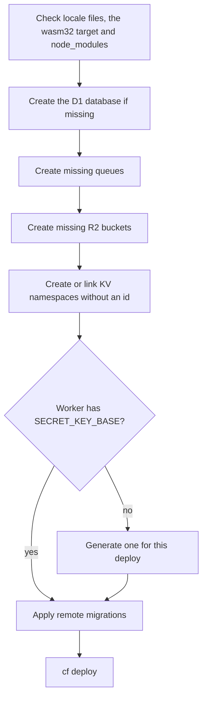

# Deployment

The `ocre deploy` command builds the app in release mode, creates the Cloudflare resources it is missing, applies the D1 migrations and publishes the Worker on `workers.dev`. This page explains each step, how to set production variables and secrets, run commands on the production database, roll back, add a custom domain, read logs and deploy from CI.

## Before you start

- An Ocre app created with `ocre new`, with its npm packages installed (`ocre new` runs `npm install`; after `--no-install` or in a fresh clone, run `npm install` in the app).
- Rust installed with rustup (the app's `rust-toolchain.toml` adds the `wasm32-unknown-unknown` target) and Node.js 22 or newer (Cloudflare's `cf` CLI needs it).
- A Cloudflare account; the free plan is enough. Sign up at <https://dash.cloudflare.com/sign-up>.
- If the app has `attachment` fields (a `STORAGE: bindings.r2(...)` entry in `cloudflare.config.ts`): R2 enabled once in the dashboard (Storage & databases > R2). Cloudflare asks for a payment method even for the free tier ([R2 pricing](https://developers.cloudflare.com/r2/pricing/), September 2026).
- Either a browser login (`ocre login`, below) or an API token in `CLOUDFLARE_API_TOKEN` (see [Deploy from CI](#ci)).

## Log in to Cloudflare

```sh
ocre login
```

`ocre login` runs `cf auth whoami`; when you are not logged in, it runs `cf auth login`, which opens the browser to approve access (OAuth), then checks again. It prints `Logged in to Cloudflare as <your email>` (with `--json`: `{"command":"login","email":"<your email>","ok":true}`). cf keeps the login, so this is needed once per machine.

cf keeps its own login, separate from wrangler's. If you deployed with an earlier Ocre (which ran wrangler), log in once again after upgrading; `ocre doctor` reminds you when it finds a wrangler login but no cf one.

### Several Cloudflare accounts

When your login has access to several accounts, cf needs to know which one to deploy to:

- New app: `ocre new blog --account-id <id> --login` (or `--deploy`) checks that the login can use that account and writes `accountId: "<id>",` at the top of `cloudflare.config.ts`, before `worker:`. Without `--account-id`, `ocre new --login` fails with `this Cloudflare login has several accounts` and a hint listing them as `id (name)`.
- Existing app: add `accountId: "<id>",` inside `defineConfig({ ... })` yourself, or set `CLOUDFLARE_ACCOUNT_ID` in the environment. `npx cf auth whoami` lists the accounts of your login.
- Several logins on one machine (a personal and a work account): cf has named profiles. `npx cf auth create <profile>` adds one, and `npx cf auth activate <profile> .` in the app directory binds it to that app, so every `ocre` command run there uses it.

## Deploy

```sh
ocre deploy
```

Run it from the app directory (or any directory below it). It takes the same steps on every deploy, stops at the first failure with an error and a hint naming the fix, and never deploys half-provisioned. Ocre creates every resource itself before `cf deploy` runs:



1. **Checks.** Locale files the Worker could not load (`locales/*.yml`) stop the deploy with the file, the line and the fix (see [Translations](i18n.md)). Then it checks that `rustc` has the `wasm32-unknown-unknown` target (if not: `the wasm32-unknown-unknown target is not installed for rustc at <sysroot>`, with the hint to use a rustup toolchain), and that `node_modules` has the app's `cf` and `wrangler` (if not: `the app's npm packages are not installed ...`, with the hint to run `npm install`).
2. **Database.** It looks for the `DB` database (`DB: bindings.d1({ name: "blog" })`) with `cf d1 list --name blog` and creates it with `cf d1 create --name blog` when missing. The config needs no database id: Ocre resolves the name to the id each time.
3. **Queues.** For every queue `cloudflare.config.ts` names (`bindings.queue` and `triggers.queue` names, and each `deadLetterQueue`, written by the first `ocre g job`), it checks `cf queues list` and runs `cf queues create --queue-name <name>` for the missing ones. A consumer of a missing queue would fail the deploy.
4. **R2 buckets.** Each `bindings.r2({ name })` (`<app>-storage`, written by the first `attachment` field) is checked with `cf r2 buckets get` and created with `cf r2 buckets create` when missing. An account without R2 gets Cloudflare's API error 10042, and the deploy stops with this hint: "enable R2 once in the Cloudflare dashboard (Storage & databases > R2; the free plan asks for a payment method but charges nothing within 10 GB, 1M writes and 10M reads a month), then run `ocre deploy` again".
5. **KV namespaces.** Each `bindings.kv()` entry without an `id` (the `CACHE` binding of `ocre g cache`) gets the namespace titled `<worker name>-<binding>`, lowercased with `_` as `-` (`blog-cache`). If `cf kv namespaces list` already has it, it is linked; otherwise `cf kv namespaces create` makes it. Either way `ocre deploy` rewrites the entry to `CACHE: bindings.kv({ id: "<id>" }),` in `cloudflare.config.ts`: commit that change.
6. **`SECRET_KEY_BASE`.** It runs `cf workers secrets list --worker <name>`. When the Worker has no `SECRET_KEY_BASE` (or does not exist yet), it takes the one of `.prod.vars`, or else generates a random one (128 hex characters, like `ocre secret`) and, once the deploy succeeded, appends it to `.prod.vars` (git-ignored, readable by you only) with a comment: Cloudflare never gives a secret back, and losing it signs everyone out and makes [encrypted columns](models.md#encrypted-columns) unreadable, so back that file up. It writes the value to `.wrangler/ocre-secrets.env` (readable by you only, git-ignored), passes it to `cf deploy --secrets-file`, and deletes the file afterwards, even when the deploy fails. An existing secret is never replaced: that would sign every user out. If the secrets list fails for any other reason, the deploy stops rather than risk overwriting it.
7. **Migrations.** `cf d1 migrations apply <id>` on the production database, before the new code goes live, so it never runs against an old schema. On the first deploy the database is new and gets every migration.
8. **Build and upload.** `cf deploy`, with `OCRE_BUILD=--release`. cf delegates the build to the app's wrangler, which runs the `build.command` of `wrangler.config.ts`, `worker-build --release` (installing `worker-build` 0.8 with `cargo install` if needed): an optimized WebAssembly build passed through `wasm-opt`. Durable Objects (the `CHANNELS` namespace of realtime apps) are created by this step from the `exports` of `cloudflare.config.ts`; nothing else to provision.
9. **URL.** The report shows the first `https://...workers.dev` address cf printed.

`ocre deploy` does not load `db/seeds.sql` into production; run `ocre db seed --remote` if you want it there.

### Why wrangler still appears

Ocre drives Cloudflare's `cf` CLI, yet each app also has `wrangler` in its `package.json`, and you will see `wrangler` in some output. Two reasons, both on purpose:

- **cf delegates builds to the app's wrangler.** `cf dev`, `cf build` and the build step of `cf deploy` hand the build (and, for `cf dev`, the local server) to the app's wrangler (`node_modules/wrangler`, 4.136 or newer), which reads `wrangler.config.ts`. The local server's lines (`[wrangler:info] Ready on http://localhost:8787`, `[custom build] ...`) come from it.
- **Local database commands run the app's wrangler.** cf 1.0.0-beta.5's local D1 addresses databases only by UUID (while the dev server keys the local database by its binding name), keeps its state outside the app, and its local writes do not exit. So `ocre migrate`, `ocre migrate --status`, `ocre db create/seed/reset/prepare/truncate/version/schema`, `ocre sql`, `ocre test --e2e` and `ocre doctor`'s migration check run `node_modules/.bin/wrangler d1 ... DB --local` with a config Ocre derives from `cloudflare.config.ts` (`.wrangler/ocre-d1.json`) and the same `.wrangler/state` as `cf dev`. Their `--remote` forms use cf.

You never run wrangler yourself, and it needs no login of its own. Ocre will drop the local fallback once cf's local D1 can replace it (see the [roadmap](https://github.com/tgeselle/ocre.rs/blob/main/ROADMAP.md#ocre-platform-work)).

### What it prints

cf's output streams as it runs, then `ocre deploy` summarizes what it created and the URL. With a new app that has a job, a cache and an attachment, the end looks like this (the lines come from the CLI's code and integration tests; these docs did not run a real deploy):

```text
...
Created the SECRET_KEY_BASE secret on Cloudflare
Saved it in .prod.vars (git-ignored): back it up, Cloudflare never gives it back
Created D1 database blog on Cloudflare
Created queue blog-jobs on Cloudflare
Created queue blog-jobs-failed on Cloudflare
Created R2 bucket blog-storage on Cloudflare
Created KV namespace blog-cache (id written to cloudflare.config.ts) on Cloudflare

https://blog.<your-subdomain>.workers.dev
```

Later deploys print only the URL after cf's output: everything exists.

### JSON output

With `--json`, the output of cf and wrangler goes to stderr and stdout carries one JSON object; the command never prompts and exits with 0 on success, 1 on failure:

```json
{"command":"deploy","ok":true,"provisioned":["D1 database blog","queue blog-jobs","queue blog-jobs-failed","R2 bucket blog-storage","KV namespace blog-cache (id written to cloudflare.config.ts)"],"secret_created":true,"url":"https://blog.<your-subdomain>.workers.dev"}
```

| Key | Present | Meaning |
|---|---|---|
| `ok`, `command` | always | `true`, `"deploy"` |
| `url` | when cf printed a `workers.dev` URL | The deployed URL. Absent when the Worker is only on a custom domain (`workersDev: false`) |
| `secret_created` | only when `true` | A `SECRET_KEY_BASE` was uploaded with this deploy. The secret itself is never printed |
| `secret_saved` | only when set | `".prod.vars"`: the generated secret was written there |
| `provisioned` | only when not empty | Resources created because they were missing: `D1 database <name>`, `queue <name>`, `R2 bucket <name>`, `KV namespace <title> (id written to cloudflare.config.ts)` |

A failure is `{"ok": false, "error": "...", "hint": "..."}`, for example when not logged in:

```json
{"error":"`cf d1 list --name blog` failed: ┌ Error ...","hint":"log in with `ocre login`, or set CLOUDFLARE_API_TOKEN (and CLOUDFLARE_ACCOUNT_ID when the token sees several accounts)","ok":false}
```

When a cf command itself fails, `error` is `` `cf <args>` failed (exit status: 1) `` and the cause is in cf's output on stderr.

## Check the build size

The Worker is one WebAssembly module plus a small JavaScript shim. To see its size without uploading anything, build it in release mode like `ocre deploy` does (no login needed), then look at `build/index_bg.wasm`:

```sh
npx cf build
ls -l build/index_bg.wasm
```

`npx cf deploy --dry-run` also builds and validates the whole deploy without uploading. For the blog starter (`ocre new blog --starter blog`), in September 2026 (a wrangler dry run of the time):

```text
[custom build]     Finished `release` profile [optimized] target(s) in 46.90s
[custom build] [INFO]: Optimizing wasm binaries with `wasm-opt`...
...
[custom build]   index.js  25.4kb
...
Total Upload: 790.66 KiB / gzip: 238.60 KiB
```

`build/index_bg.wasm` was 766,215 bytes. The limit that applies is the uncompressed size, 64 MiB on both the Free and Paid plans, and a Worker must start within 1 second ([Workers limits](https://developers.cloudflare.com/workers/platform/limits/), September 2026). Size matters more for start-up CPU than for the limit: the `graphql` feature (`ocre g api ... --graphql`) adds about 1.1 MB and 20-60 ms of CPU when a new Worker instance starts.

## Production variables and secrets

`.dev.vars` is for `ocre dev` only; it is never uploaded. Production reads plain variables from the `bindings.text(...)` entries of `cloudflare.config.ts` (deployed with the code) and secrets from Cloudflare (uploaded with `ocre secrets push` from a git-ignored file, never committed):

| Name | Kind | Set it with | Needed for |
|---|---|---|---|
| `SECRET_KEY_BASE` | secret | `ocre deploy` (first deploy) | Sessions, flash, CSRF-protected forms, JWTs |
| `MAIL_FROM` | var | `MAIL_FROM: bindings.text(...)`, written by `ocre new` with a placeholder | Sending email: an address on your domain |
| `MAIL_ADAPTER` | var | `MAIL_ADAPTER: bindings.text("resend")` or `"cloudflare"` | Sending email at all: unset, `ocre::mail::send` fails with a 500 whose log names the fix |
| `RESEND_API_KEY` | secret | `ocre secrets push RESEND_API_KEY --file .prod.vars` | `MAIL_ADAPTER = "resend"` |
| `ALLOWED_ORIGINS` | var | `ALLOWED_ORIGINS: bindings.text("https://app.example.com")` | A frontend on another origin calling the app from the browser (CORS, CSRF) |
| `ALLOWED_HOSTS` | var | `ALLOWED_HOSTS: bindings.text("example.com, .example.com")` | Answering only on your own host names (other hosts get 403) |
| `SECRET_KEY_BASE_PREVIOUS` | secret | `ocre secrets push SECRET_KEY_BASE_PREVIOUS --file .prod.vars` | Rotating `SECRET_KEY_BASE` without signing anyone out |
| `GITHUB_CLIENT_ID`, `GITHUB_CLIENT_SECRET` (or `GOOGLE_...`) | secret | `ocre secrets push <NAME>... --file .prod.vars` | `ocre g auth --oauth github` (or `google`) |

```ts
// cloudflare.config.ts, in worker.env
MAIL_FROM: bindings.text("Blog <noreply@example.com>"),
MAIL_ADAPTER: bindings.text("resend"),
ALLOWED_ORIGINS: bindings.text("https://app.example.com, https://admin.example.com"),
```

Secret values go in `.prod.vars`, one `NAME=value` per line; the app's `.gitignore` lists it, so it is never committed:

```text
# .prod.vars
RESEND_API_KEY=re_...
```

```sh
ocre secrets push RESEND_API_KEY --file .prod.vars   # one upload; the Worker gets it at once
ocre secrets list                                    # names locally and on the Worker, never values
ocre deploy                                          # deploys the variable changes
```

The value is read from the file, so it never appears in your shell history or process list. `ocre secrets push` uploads several names in one call (`cf workers secrets bulk`, a new Worker version without a rebuild); the Worker must exist, so push after the first `ocre deploy`.

Without `MAIL_ADAPTER`, everything that sends email fails in production, including the sign-up, magic-link and password-reset pages of `ocre g auth`. Details and free-plan limits of each adapter: [Email](email.md); every variable: [Configuration](../reference/configuration.md).

`ocre doctor` checks this setup before a deploy (Loco's production safety check): its `production config` check fails when a plain-text variable of `worker.env` is named like a secret (`..._TOKEN`, `..._API_KEY`, `..._PASSWORD`...) or when `.gitignore` lacks `.dev.vars`, and warns on development values left in `worker.env` (`MAIL_ADAPTER = "log"`, `CACHE_STORE = "null"`, `LOG_LEVEL = "debug"`). A missing secret is not a boot failure on Workers: the request that needs it answers 500 and Workers Logs names the secret (`[ocre]` line), and `ocre doctor`'s `production secrets` check lists the missing ones ahead of time. Your own checks go in `.ocre/doctor/` as executables (see [`ocre doctor`](../reference/cli.md#ocre-doctor)).

### Rotating SECRET_KEY_BASE

`ocre deploy` never changes an existing `SECRET_KEY_BASE`. To rotate it without signing anyone out, upload the current value as `SECRET_KEY_BASE_PREVIOUS` together with a new one (Worker secrets cannot be read back, so use the value you saved). In `.prod.vars`:

```text
SECRET_KEY_BASE_PREVIOUS=<the current SECRET_KEY_BASE>
SECRET_KEY_BASE=<a new value from `ocre secret`>
```

```sh
ocre secrets push SECRET_KEY_BASE_PREVIOUS SECRET_KEY_BASE --file .prod.vars
```

Cookies encrypted with the old value are read and re-encrypted with the new one, and JWTs signed with it verify until they expire. Delete `SECRET_KEY_BASE_PREVIOUS` (dashboard: Workers & Pages > your Worker > Settings > Variables and Secrets, or `npx cf workers secrets delete SECRET_KEY_BASE_PREVIOUS --worker <app> --force`; without `--force` cf prints "Aborted." and deletes nothing) after the longest session lifetime (two weeks with `ocre g auth`). Rotating without it signs every user out and stops every JWT at once, which is what you want after a leak. API keys and emailed links are stored as digests in D1 and keep working either way. See [Configuration](../reference/configuration.md#secret_key_base_previous) and [Security model](../explanations/security-model.md).

## Commands on the production database

The database commands target the local database unless you pass `--remote`:

```sh
ocre migrate --status --remote                 # pending migrations in production
ocre migrate --remote                          # apply them without deploying code
ocre db seed --remote                          # run db/seeds.sql in production
ocre sql "SELECT COUNT(*) AS n FROM posts" --remote
```

`ocre migrate --status --remote`, `ocre db seed --remote` and `ocre sql --remote` print `Target: remote D1 database on Cloudflare` in human mode, and their `--json` report has `"remote": true`. `ocre db reset` has no `--remote` flag: it only deletes the local database. Every remote query counts against D1's daily free-plan quotas ([Free-plan limits](../reference/limits.md)).

## Migrations, deploys and compatibility

For an existing database, `ocre deploy` applies migrations before the new code goes live, so for a moment the old code runs against the new schema. Write migrations the running code survives:

- Add columns as optional (`field:type?`) or with a default, then use them in the same deploy.
- Remove or rename a column in two deploys: first deploy code that no longer uses it, then the migration that drops it.
- If a migration fails, D1 rolls that migration back and `ocre deploy` stops before `cf deploy`: the previous code keeps running on the previous schema.

Never edit an applied migration; add a new one with `ocre g migration` (see [Models and migrations](models.md)).

## Roll back

Each deploy creates a new version of the Worker. cf lists them and deploys an older one again (a rollback is a deployment of a previous version at 100%):

```sh
npx cf workers deployments list --worker blog         # recent deployments
npx cf workers versions list --worker-id blog         # recent versions, with their ids
npx cf workers deployments create --worker blog --strategy percentage \
  --versions '[{"version_id":"<version-id>","percentage":100}]'
```

The dashboard does the same (Workers & Pages > your Worker > Deployments > Rollback). `npx cf <command> --help` and `npx cf schema <command>` show every option.

A rollback changes the code only ([Rollbacks](https://developers.cloudflare.com/workers/versions-and-deployments/rollbacks/), September 2026):

- Bound resources are not changed: the D1 schema stays migrated. The older code must work with the newer schema, which the rules of the previous section give you.
- You can roll back to the 100 most recent versions only.
- Cloudflare refuses a rollback across a Durable Object class migration, such as the one that created the `OcreChannel` class of the first `ocre g scaffold ... --realtime`, and to a version bound to an R2 bucket, KV namespace or queue that no longer exists.

D1 has no down migrations. To undo a schema change, write a new migration. To undo data changes (a bad backfill, a `DELETE` without `WHERE`), D1 Time Travel restores the whole database to a minute in the past, up to 7 days back on the Free plan ([Time Travel](https://developers.cloudflare.com/d1/reference/time-travel/), September 2026). It overwrites everything written since:

```sh
npx cf d1 list --name blog                                               # the database's uuid
npx cf d1 time-travel get-bookmark <uuid>                                # current bookmark
npx cf d1 time-travel restore <uuid> --timestamp 2026-09-29T10:00:00Z
```

To delete a production database on purpose, use the dashboard or `npx cf d1 delete <uuid> --force` (without `--force` cf prints "Aborted." and deletes nothing); Ocre itself never deletes production data.

## Custom domains

The first deploy publishes the app on `https://<app>.<your-subdomain>.workers.dev`. To serve it on your own domain, the domain must be an active zone in the same Cloudflare account; then add it to `worker` in `cloudflare.config.ts`:

```ts
worker: {
	name: "blog",
	domains: ["blog.example.com"],
	// ...
},
```

and run `ocre deploy`. `ocre domains add blog.example.com` writes that entry (and `ocre domains remove` takes one out; see [`ocre domains`](../reference/cli.md#ocre-domains)). Cloudflare creates the DNS record and the certificate ([Custom Domains](https://developers.cloudflare.com/workers/configuration/routing/custom-domains/)). The `workers.dev` address keeps working unless you add `workersDev: false`; `ocre deploy` then reports no `url`. (`domains` and `workersDev` are keys of cf's config types, and cf's loader accepts the entry `ocre domains` writes; this page did not deploy one.)

A custom domain changes a few things in an Ocre app:

- Links in emails from `ocre g auth` use the host of the request, so they follow whichever domain the user came from.
- Cloudflare WAF rate limiting rules (next section) apply to zones, so they need a custom domain.
- `ALLOWED_HOSTS` (see [Configuration](../reference/configuration.md#allowed_hosts)) can then keep visitors off the `workers.dev` address: requests for unlisted hosts get 403.
- The Cache API (`caches.default`) only stores responses on custom domains (see [Caching](caching.md)).

## Before going public: rate limiting

`ocre g auth` limits its login, sign-up, magic-link, password-reset, confirmation, token and account-deletion routes to 10 attempts a minute per client IP address and action: the generated `throttle` calls `ocre::security::rate_limit` against the `AUTH_RATE_LIMITER` [Workers Rate Limiting binding](https://developers.cloudflare.com/workers/runtime-apis/bindings/rate-limit/) it adds to `cloudflare.config.ts`, and over the limit the answer is `429 Too Many Requests`. The binding works on `workers.dev` and on custom domains, is on the free plan, and uses no D1 or KV operation. Its counters are per Cloudflare location and approximate, so treat it as a brake, not an exact quota. Before going public, check that:

- the `AUTH_RATE_LIMITER: bindings.rateLimit(...)` entry is still in `cloudflare.config.ts` (without it, those routes answer 500 and the log names the entry to add), and `limit` and `period` (10 or 60 seconds) suit you;
- your own routes that are expensive or send email call `ocre::security::rate_limit` with a binding of their own (see [Sessions, flash and security](security.md#rate-limiting)).

With a custom domain, a [Cloudflare WAF rate limiting rule](https://developers.cloudflare.com/waf/rate-limiting-rules/) can add a limit before the Worker runs, so blocked requests cost no Worker request. On the Free plan (September 2026): one rule, matching on the URI path, counting requests per IP address over 10 seconds, blocking for 10 seconds.

## Logs

Apps made by `ocre new` have `observability: { enabled: true }` in `cloudflare.config.ts`, which keeps every request and log line in Workers Logs, searchable in the dashboard (Workers & Pages > your Worker > Logs, with a live view); search for `[ocre` to see Ocre's own lines. The free plan keeps 200,000 events a day for 3 days (see [Configuration](../reference/configuration.md#top-level-and-worker-keys)). From a terminal, `npx cf observability telemetry query --help` queries the same logs (`npx cf cli search "query worker logs"` finds related commands).

`ocre logs` streams the deployed Worker's logs live (`--status error`, `--search <text>`, `--format json`), and `ctx.log()` writes structured lines whose fields Workers Logs indexes; to send errors to Sentry, see [Errors, logging and debugging](debugging.md).

Ocre never shows internal errors to users: a 500 page or JSON error says `Internal server error`, and the details go to the log with a prefix:

| Prefix | Written by |
|---|---|
| `[ocre]` | Any `Error::Internal`: missing binding or secret, failed D1 query (with its SQL), invalid digest... |
| `[ocre jobs]` | Background jobs: `<job> done`, failures and retries, `dropped message` |
| `[ocre cron]` | Scheduled tasks, including failed runs (not retried) |
| `[ocre mail]` | The `log` mail adapter (development) |
| `[ocre cache]` | KV failures, after which `ocre::cache::fetch` computes the value |
| `[ocre realtime]` | Failed broadcasts |

## CI

`ocre deploy` never needs `ocre login` in CI: cf authenticates with the `CLOUDFLARE_API_TOKEN` environment variable instead of a browser login, and takes the account from `CLOUDFLARE_ACCOUNT_ID` when the token can see several accounts (cf checks the token before any login or profile). `ocre deploy` runs cf with the environment it was given, and the CLI's hints name both variables when a Cloudflare call fails.

```sh
ocre g ci
```

writes `.github/workflows/ci.yml` (see [`ocre g ci`](../reference/generators.md#ocre-g-ci)): a `check` job on every push and pull request runs the steps of `ocre ci` (`cargo fmt --check`, `cargo clippy --all-targets -- -D warnings`, `cargo test`, the wasm32 check, and `ocre i18n missing` when the app has locales), then a `deploy` job runs `ocre deploy --json` on pushes to `main`. `ocre ci` runs the same checks on your machine first (Rails 8.1's local CI; `ocre ci --signoff` then marks the commit green with `gh signoff`). To set it up:

1. Create a token in the dashboard (My Profile > API Tokens) that can edit what `ocre deploy` touches: Account permissions "Workers Scripts: Edit" and "D1: Edit", plus "Queues: Edit", "Workers KV Storage: Edit" and "Workers R2 Storage: Edit" when the app uses them, and the zone permission "Workers Routes: Edit" for custom domains.
2. Store it as the repository secret `CLOUDFLARE_API_TOKEN`, and your account id as `CLOUDFLARE_ACCOUNT_ID` (needed when the token sees several accounts) in Settings > Secrets and variables > Actions.
3. Run the first deploy locally (or commit afterwards) so the KV `id` that `ocre deploy` writes into `cloudflare.config.ts` is committed. A CI deploy without it finds the namespace by title and links it again, in its own checkout.
4. Commit `package.json` and `package-lock.json`; the deploy job installs the pinned `cf` and `wrangler` with `npm ci`.

The workflow installs the CLI with `cargo install --git https://github.com/tgeselle/ocre.rs ocre-cli` and caches Rust builds with `Swatinem/rust-cache`. It is yours to edit; `--force` rewrites it from the generator.

On a developer machine with several Cloudflare logins, a cf profile does the same job as the token: `npx cf auth activate <profile> .` binds one to the app directory.

## See also

- [CLI commands](../reference/cli.md): [`ocre deploy`](../reference/cli.md#ocre-deploy), [`ocre login`](../reference/cli.md#ocre-login), [`ocre migrate`](../reference/cli.md#ocre-migrate), [`ocre secret`](../reference/cli.md#ocre-secret)
- [Configuration](../reference/configuration.md): [`SECRET_KEY_BASE`](../reference/configuration.md#secret_key_base), [`MAIL_ADAPTER`](../reference/configuration.md#mail_adapter), [`ALLOWED_ORIGINS`](../reference/configuration.md#allowed_origins)
- [Free-plan limits](../reference/limits.md) and [Cost model](../explanations/cost-model.md)
- [Security model](../explanations/security-model.md): what `SECRET_KEY_BASE` protects, and what Ocre leaves to rate limiting
- [Testing an Ocre app](testing.md): checks to run before deploying
