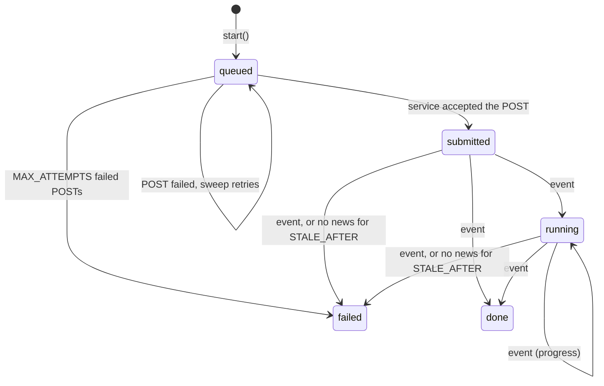

# Webhooks and external services

A payment provider confirms a payment, a GPU service reports that a job finished, a mail service reports a bounce: each calls the app back with an HTTP POST, a webhook. Ocre checks the signature of the call, keeps a log of the events received, and runs each event's effect once, however many times the sender delivers it. `ocre::webhooks` also signs the calls the app makes, so a service can check them the same way.

## Receive a webhook

```sh
ocre g webhook payments
ocre migrate
```

```text
  create  src/payments_webhook.rs
  create  tests/payments_webhook.rs
  create  migrations/0001_create_webhook_events.sql
  update  .dev.vars
  update  src/lib.rs
```

`src/payments_webhook.rs` answers `POST /webhooks/payments`:

1. It checks the signature: the HMAC-SHA256 of the raw body with the secret `PAYMENTS_WEBHOOK_SECRET`, sent in the `X-Signature` header as hex, `sha256=<hex>` (GitHub's form) or base64. A missing or wrong signature is a 401.
2. It parses the body as JSON and reads the event's `id` (a string or a number); without one, 400.
3. It runs `handle(&ctx, &event)` through `webhooks::once`, which records the event in `webhook_events` and skips it if it was already processed.
4. It answers `{"status": "processed"}`, or `{"status": "duplicate"}` for an event already processed.

Write the effect in `handle`:

```rust
async fn handle(ctx: &Ctx, event: &Value) -> Result<()> {
    if event["type"] == "payment.paid" {
        let order_id = event["data"]["order_id"].as_i64().ok_or_else(|| Error::bad_request("no order_id"))?;
        ctx.db()?
            .execute("UPDATE orders SET status = 'paid' WHERE id = ?1 AND status = 'pending'", params![order_id])
            .await?;
    }
    Ok(())
}
```

The generator puts a random secret in `.dev.vars`. Give the sender the URL (`https://<your host>/webhooks/payments`) and the production secret (the provider often generates it: use theirs), and upload it:

```sh
ocre secrets push PAYMENTS_WEBHOOK_SECRET --file .prod.vars
```

Webhook requests come from servers, not browsers: they carry no `Origin` or `Sec-Fetch-Site` header, so Ocre's [cross-site request check](security.md) lets them through, and the signature is what authenticates them.

### Standard Webhooks

Providers that follow [Standard Webhooks](https://www.standardwebhooks.com) (Svix and the services built on it, Resend...) send `webhook-id`, `webhook-timestamp` and `webhook-signature` headers and give a `whsec_...` secret:

```sh
ocre g webhook mail_events --standard
```

The handler calls `webhooks::verify_standard(&secret, &headers, &body, 300, ocre::now())`: a signature of `{id}.{timestamp}.{body}` must match (several space-separated `v1,<base64>` signatures are accepted, for secret rotation), and the timestamp must be within 5 minutes, so a captured delivery cannot be replayed later. The `webhook-id` is the event id.

### Other signature schemes

Providers sign in many ways. `webhooks::verify(secret, message, signature)` checks an HMAC-SHA256 of any `message`, so the handler builds what the provider signs:

| Provider style | Header | Message to verify |
|---|---|---|
| Plain HMAC (GitHub, many APIs) | `X-Hub-Signature-256: sha256=<hex>` | the raw body |
| Timestamped (Stripe) | `Stripe-Signature: t=<ts>,v1=<hex>` | `format!("{t}.{body}")`; then check `t` against `ocre::now()` |
| Standard Webhooks | `webhook-signature: v1,<base64>` | use `verify_standard` |

Always verify the raw body (`body: Bytes`), not JSON parsed and serialized again: a reordered key or a different space changes the signature. A provider without signatures (some send a token in the URL or a header) is checked by comparing that token with `ocre::token::constant_time_eq`; prefer a provider option that signs.

## Each event once

Senders retry until they get a 2xx answer, and may deliver an event twice even after a success. `webhooks::once(&db, source, event_id, payload, effect)`:

- inserts `(source, event_id)` into `webhook_events` with the raw payload and status `processing`; the pair is unique, so a second delivery of the same event inserts nothing and gets `Delivery::Duplicate` without running the effect;
- runs the effect; on success marks the event `processed`; on failure marks it `failed` with the error message and returns the error, so the handler answers 500 and the sender's retry runs the effect again;
- takes over an event left `processing` for more than 5 minutes (`webhooks::STALE_AFTER`): the invocation that claimed it died.

The table doubles as a log of what was received:

```sh
ocre sql "SELECT source, event_id, status, attempts, error FROM webhook_events ORDER BY id DESC LIMIT 20"
```

Recording and effect are separate D1 statements. Write effects that are safe to run again (`UPDATE ... WHERE status = 'pending'`, `INSERT ... ON CONFLICT DO NOTHING`), so an invocation that dies between the effect and the `processed` mark does no harm when the event runs again. Each delivery costs two or three D1 writes.

## Test a webhook

`tests/payments_webhook.rs` has two request tests, run by `ocre test --e2e`: an event signed with the wrong secret gets 401, and the same signed event delivered twice is `processed`, then `duplicate`. They sign with the secret of `.dev.vars`, read with `ocre::testing::var`:

```rust
let body = format!(r#"{{"id":"{id}","type":"payment.paid","data":{{"order_id":{order_id}}}}}"#);
let mut client = Client::new().header("X-Signature", &webhooks::sign(secret().as_bytes(), body.as_bytes()));
client.request("POST", "/webhooks/payments", Some(("application/json", body.into_bytes()))).assert_status(200);
```

In `ocre dev`, a provider's dashboard cannot reach `localhost`: send test events with curl and a signature computed the same way, or expose the dev server with a tunnel (`cloudflared tunnel --url http://localhost:8787`).

## Run work on another service

A Worker cannot start programs (no `ffmpeg`, no Python) and has 10 ms of CPU per invocation on the free plan. Video encoding, AI inference and other heavy work run elsewhere, and the app tracks them: it submits a job, the service reports back, and a schedule catches jobs that went silent.

```sh
ocre g external_job upscale video_id:integer scale:float
ocre migrate
```

```text
  create  src/upscale_jobs.rs
  create  migrations/0001_create_upscale_jobs.sql
  create  src/schedules/upscale_jobs_sweep.rs
  create  src/schedules/mod.rs
  update  cloudflare.config.ts
  update  src/lib.rs
  update  .dev.vars
```

Each job is a row of `upscale_jobs` with the inputs (`video_id`, `scale`), a `status`, the service's `external_id`, `progress` (0-100), `result` (the service's output as JSON text), `error` and `attempts`:



- **Submit.** `upscale_jobs::start(&ctx, video_id, scale).await?` inserts the job and POSTs `request_body(&job, webhook)` to `UPSCALE_URL`, signed with `UPSCALE_SECRET` (`X-Signature`), plus `Authorization: Bearer <UPSCALE_TOKEN>` when that secret is set (RunPod, Modal and most APIs take an API key that way). The body names the address to report to, `<APP_URL>/webhooks/upscale/<id>?token=<the job's token>`. A 2xx answer makes the job `submitted` and keeps the `id` of the answer as `external_id`; anything else keeps it `queued` with the error.
- **Receive events.** The service POSTs JSON to that address: a `status` (`running`, `done`, `failed`, or RunPod's `IN_QUEUE`, `IN_PROGRESS`, `COMPLETED`, `FAILED`, `CANCELLED`, `TIMED_OUT`), and optionally `progress`, `output` (or `result`) and `error`. An event must be signed with the shared secret or carry the job's token: RunPod and many GPU services cannot sign their callbacks, and a random token per job means a leaked URL exposes one job only. Events only move a job forward, so a repeated or late event changes nothing (a `running` event after `done` is ignored), and no event log is needed.
- **Sweep.** `src/schedules/upscale_jobs_sweep.rs` runs every 5 minutes (`--sweep "every 10 minutes"` to change it; it uses one of the 5 Cron Triggers of the free plan) and calls `upscale_jobs::sweep`: jobs `submitted` or `running` without news for `STALE_AFTER` (an hour) become `failed`, and `queued` jobs whose submission failed more than `RETRY_AFTER` seconds ago are submitted again, 10 per run, until `MAX_ATTEMPTS`.
- **React.** `changed(&ctx, &job)` runs after every change: send the result by email, enqueue the next job, or broadcast the progress to the pages showing it ([Realtime](realtime.md)).

Adapt two functions to the service: `request_body` (what it expects; the generated one is RunPod's `{"input": {...}, "webhook": "..."}` with the job `id` added) and `handle_event` (how it reports). Services that only answer polling (no callback) can be polled from `sweep`: fetch the status of the `submitted` and `running` jobs and pass each answer to `handle_event`.

Settings: `UPSCALE_URL` (the service's endpoint) and `APP_URL` (this app's public address, for the callback) go in `worker.env` of `cloudflare.config.ts`; `UPSCALE_SECRET` and `UPSCALE_TOKEN` are secrets (`ocre secrets push UPSCALE_SECRET UPSCALE_TOKEN --file .prod.vars`). The generator adds `UPSCALE_URL`, `UPSCALE_SECRET` and `APP_URL` to `.dev.vars`.

Costs: a submission is one subrequest and two D1 queries; an event two D1 queries. The service itself is billed by its provider: RunPod and Modal charge GPU time per second; [Cloudflare Containers](https://developers.cloudflare.com/containers/) need the Workers Paid plan, and are called through a Durable Object binding rather than a URL, so `submit` calls the container's binding instead of `post_signed`. A container (or any service) can run `ffmpeg`/`ffprobe`: probe a video's duration and resolution there and report them in an event's `output`.

## Sign the calls you send

When the app calls a service that checks signatures (or another app of yours), sign the body:

```rust
let body = serde_json::to_vec(&job)?;
let signature = ocre::webhooks::sign(secret.as_bytes(), &body); // lowercase hex HMAC-SHA256
let response = reqwest::Client::new()
    .post(url)
    .header("X-Signature", signature)
    .header("Content-Type", "application/json")
    .body(body)
    .send()
    .await;
```

`ocre::webhooks::post_signed(url, secret, bearer, &json)` does it in one call (one subrequest) and returns the status and body; `ocre g external_job` uses it. `webhooks::sign_standard(secret, id, timestamp, body)` gives the `webhook-signature` value of a Standard Webhooks delivery. Outgoing HTTP is covered in [Calling other services](controllers.md#calling-other-services).

## See also

- [Background jobs and schedules](jobs.md): work that continues after the webhook answered.
- [CLI: secrets](../reference/cli.md#ocre-secrets) for the production secret.
